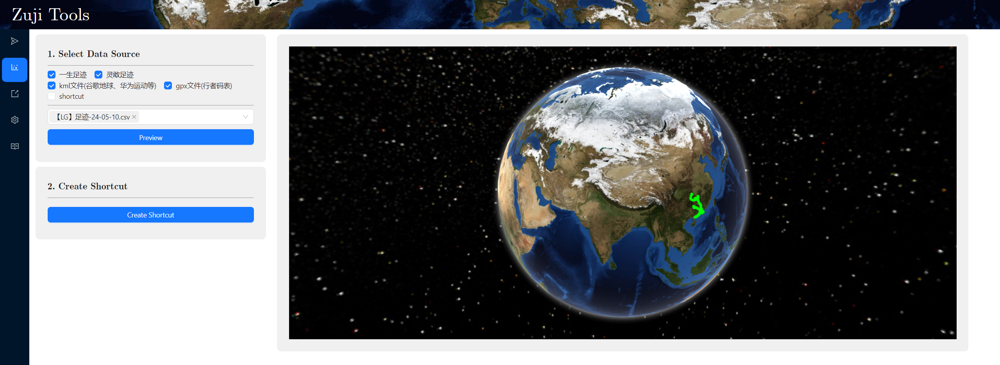

# Zuji 足迹管理工具

【这是什么项目】

作为个旅行者，探索这个世界是我的使命。

在旅途中留下足迹，不知不觉也成了个人的小小爱好。现在可供记录足迹的工具有很多，然而在不同设备之间同步足迹时往往会遇到格式不兼容的问题，本项目用于将不同数据源的轨迹数据导入为统一格式，再导出为所需的格式，实现轨迹数据再不同平台间的简易转化。

【请注意这些问题】

由于不同地理位置数据采集方式的差异，当将数据从一个平台转移到另一平台时，会造成部分数据信息的丢失，这些信息在日常使用中感知不强（例如：定位精度、水平/垂直加速度等），但是可能会对app的一些附加功能造成干扰（例如：通过定位精度进行噪音过滤、分析速度变化等），请您对自己的原始数据负责，做好数据备份。

此外，本项目免费开源，为研究实验目的开发，与轨迹app无关。由于尚在开发中，很多的使用场景还没经过严格测试，不免有系统兼容性和Bug，请多包涵。

【如何使用】

查询安装、启动与使用方法：请参考`docs/start.md`或[start](https://github.com/Aldenhovel/zuji/blob/main/docs/start.md)。

查询数据支持说明：请参考`docs/data-support.md`或[data-support](https://github.com/Aldenhovel/zuji/blob/main/docs/data-support.md)。

提建议或反馈Bug：请在Github中提issue或者发到邮箱（见主页）。